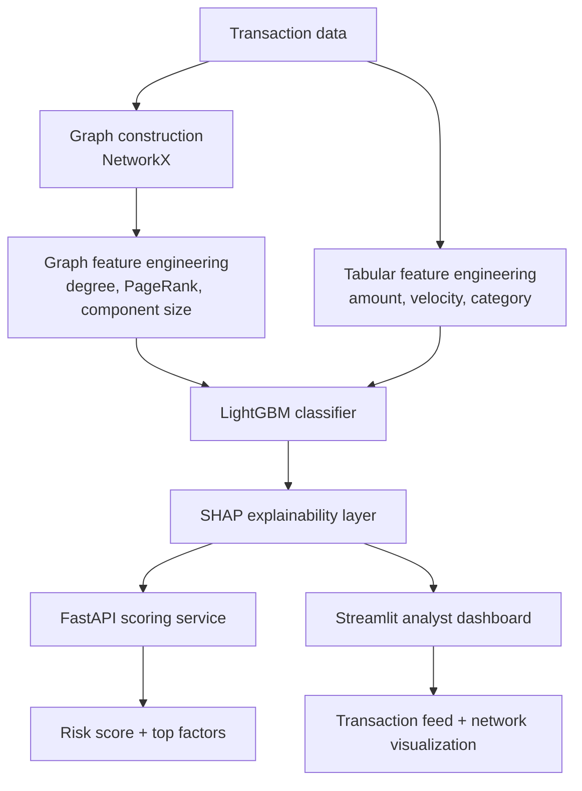

# WebLock
### Graph-Based Real-Time Fraud Detection with Explainable Risk Scoring

WebLock is an end-to-end fraud detection system that models financial transactions as a **graph** (accounts, devices, IPs, cards) rather than isolated rows, to catch coordinated fraud rings that traditional tabular models miss. It combines graph feature engineering, a gradient-boosted classifier, SHAP-based explainability, a real-time scoring API, and an analyst-facing dashboard.

---

## The problem

Most public fraud-detection projects train a tabular classifier (XGBoost/Random Forest) on a Kaggle CSV and stop there. That approach misses **coordinated fraud** - rings of accounts that deliberately behave normally at the individual-transaction level but are secretly linked through shared devices, IP addresses, or payment cards.

WebLock's core hypothesis: **relational structure catches what row-level features can't.**

## The proof

On the real-world [IEEE-CIS Fraud Detection](https://www.kaggle.com/c/ieee-fraud-detection) dataset (590,540 transactions, 3.5% fraud rate):

| Model | PR-AUC | ROC-AUC |
|---|---|---|
| Baseline (transaction features only) | 0.174 | 0.793 |
| **Graph-enhanced** (+ shared-entity graph features) | **0.219** | **0.810** |

A **+25% relative improvement in PR-AUC** from adding graph features alone, with no other changes to the model. Graph features (`pagerank`, `clustering_coefficient`, `degree`) all rank in the top 10 most important features by SHAP value, alongside transaction amount and product category.

**An honest, interesting wrinkle:** naively bucketing accounts by shared-entity cluster size shows *isolated* accounts with a higher raw fraud rate (6.9%) than heavily clustered ones (4.0%), the opposite of the synthetic proof-of-concept's pattern. This is because the account-ID proxy used here (`card1`+`card2`+`addr1`, since IEEE-CIS has no real identity key) captures broad demographic/card similarity as much as true shared identity, so large clusters are dominated by unrelated legitimate repeat customers rather than fraud rings. Despite that, the *multivariate* graph features (PageRank, clustering coefficient) still contributed real signal the tabular baseline couldn't see, the lift is genuine, just noisier and less clean than a simple threshold on cluster size. See `RESUME_AND_INTERVIEW_PREP.md` for the full discussion.

> This project also includes a synthetic dataset generator (`src/generate_data.py`) that was used during initial development, with deliberately clean fraud-ring patterns for validating the pipeline mechanics before moving to real data. Both paths are included; see "Using a real dataset" below.

## Architecture



## Screenshots

### Dashboard overview
Live fraud metrics and a filterable transaction feed, scored in real time.


### Model comparison & global feature importance
The dashboard surfaces the core research finding directly — baseline vs. graph-enhanced PR-AUC — plus model-wide feature importance, not just per-transaction explanations.


### Explainable risk scoring
Every flagged transaction comes with the top contributing factors in plain language, not just a score.


### Fraud ring network visualization
The shared-entity graph around a flagged account — accounts (blue), the selected account (red), and shared devices/IPs/cards (gray) they're tangled up with.


### Real-time API - fraud case
A high-risk transaction scored by the live FastAPI service, with SHAP-based explanation.


## What's inside

```
weblock/
├── src/
│   ├── generate_data.py      # synthetic transaction data with embedded fraud rings
│   ├── graph_features.py     # builds the shared-entity graph, computes graph features
│   ├── train_models.py       # trains + compares baseline vs graph-enhanced LightGBM
│   └── explainability.py     # SHAP-based per-transaction explanations
├── api/
│   └── main.py                # FastAPI real-time scoring service
├── dashboard/
│   └── app.py                  # Streamlit analyst dashboard
├── data/                        # generated datasets (created by scripts)
├── models/                      # trained model artifacts (created by scripts)
├── requirements.txt
├── Dockerfile                   # API container
├── Dockerfile.dashboard         # dashboard container
└── docker-compose.yml           # runs both together
```

## How it works

1. **Data generation** (`src/generate_data.py`) - creates realistic transactions: normal independent users, plus fraud rings that share a small pool of devices/IPs/cards and deliberately mimic normal transaction-level behavior (this is what makes the graph signal *necessary*, not just a bonus feature).

2. **Graph construction** (`src/graph_features.py`) - builds a graph where accounts are nodes and edges represent shared devices/IPs/cards. Computes per-account graph features: `degree`, `pagerank`, `clustering_coefficient`, `component_size`.

3. **Modeling** (`src/train_models.py`) - trains two LightGBM classifiers on an identical train/test split: one with tabular features only (baseline), one with tabular + graph features. This isolates and quantifies exactly how much the graph signal contributes.

4. **Explainability** (`src/explainability.py`) - SHAP TreeExplainer generates per-transaction, human-readable explanations ("flagged mainly because: shared device with 6 other accounts").

5. **Serving** (`api/main.py`) - FastAPI service exposing `POST /predict`, returning a fraud probability, risk tier (LOW/MEDIUM/HIGH), and the top 3 contributing factors for any transaction.

6. **Dashboard** (`dashboard/app.py`) - Streamlit app for a fraud analyst: filterable, searchable transaction feed with color-coded risk bars, per-transaction explanation panel, a live network graph visualization of the accounts/devices/IPs clustered around any flagged account, a baseline-vs-graph-enhanced model comparison chart, global SHAP feature importance, and one-click CSV export of flagged transactions.

## Running it locally

```bash
# 1. Set up environment
python -m venv venv
source venv/bin/activate   # Windows: venv\Scripts\activate
pip install -r requirements.txt

# 2. Generate data and train models (run in order)
python src/generate_data.py
python src/graph_features.py
python src/train_models.py
python src/explainability.py

# 3. Run the API
uvicorn api.main:app --reload --port 8000
# Visit http://localhost:8000/docs for interactive API docs

# 4. Run the dashboard (in a separate terminal)
streamlit run dashboard/app.py
# Visit http://localhost:8501
```

## Running with Docker

```bash
docker-compose up --build
# API:       http://localhost:8000
# Dashboard: http://localhost:8501
```

## Using a real dataset (IEEE-CIS via Kaggle)

This repo ships with a synthetic dataset by default, but includes a ready-to-run adapter for the real [IEEE-CIS Fraud Detection](https://www.kaggle.com/c/ieee-fraud-detection) dataset:

1. Create a free Kaggle account, join the (free, closed) IEEE-CIS Fraud Detection competition, and download `train_transaction.csv` and `train_identity.csv` from the Data tab.
2. Place both files in `data/kaggle/`.
3. Run `python src/prepare_kaggle_data.py` instead of `generate_data.py` — everything downstream (`graph_features.py`, `train_models.py`, `explainability.py`) works unchanged, since the adapter reshapes the real data into the same schema.

**Note on entity proxies:** IEEE-CIS doesn't provide an explicit account/device/IP identifier the way this project's synthetic data does, real fraud datasets rarely do. `prepare_kaggle_data.py` documents the specific proxy columns used (e.g. `card1`+`card2`+`addr1` as a pseudo account ID, `DeviceInfo` for device, purchaser email domain as a network proxy) and why, directly in its docstring. These are reasonable, explainable modeling choices, not ground truth — worth stating plainly if asked about them.

## Tech stack

**Data & modeling:** Python, pandas, NetworkX, LightGBM, scikit-learn
**Explainability:** SHAP
**Serving:** FastAPI, Pydantic, Uvicorn
**Dashboard:** Streamlit, Matplotlib
**Deployment:** Docker, docker-compose

## Results summary

- 590,540 real transactions from IEEE-CIS Fraud Detection, 3.5% fraud rate
- Baseline model (tabular only): PR-AUC 0.174, ROC-AUC 0.793
- Graph-enhanced model: PR-AUC 0.219, ROC-AUC 0.810 (+25% relative PR-AUC lift)
- Graph features (pagerank, clustering coefficient, degree) all rank in the top 10 SHAP features
- Entity-sharing graph capped at 50 accounts per shared value to avoid runaway generic identifiers (e.g. common card bins) polluting the graph
- Real-time scoring via API, sub-second response time
- Every prediction is explainable down to the top 3 contributing factors
- Live in-dashboard model comparison chart and global feature importance view, alongside per-transaction explanations
- A synthetic data generator is also included, used during initial pipeline development (near-perfect separation by design, useful for validating mechanics before moving to real data)

## Limitations & honest caveats

- Built on synthetic data, real-world fraud signals are noisier and more distributed across features; expect the graph signal to be a strong contributor but not this dominant on production data.
- Graph features here are computed in batch, not streaming, a production system would need incremental graph updates as new transactions arrive.
- No formal hyperparameter tuning was done (kept default-ish LightGBM settings) since the focus of this project is the graph-vs-tabular comparison, not squeezing out the last few points of accuracy.
